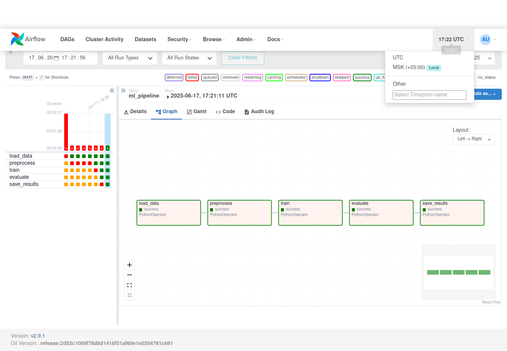
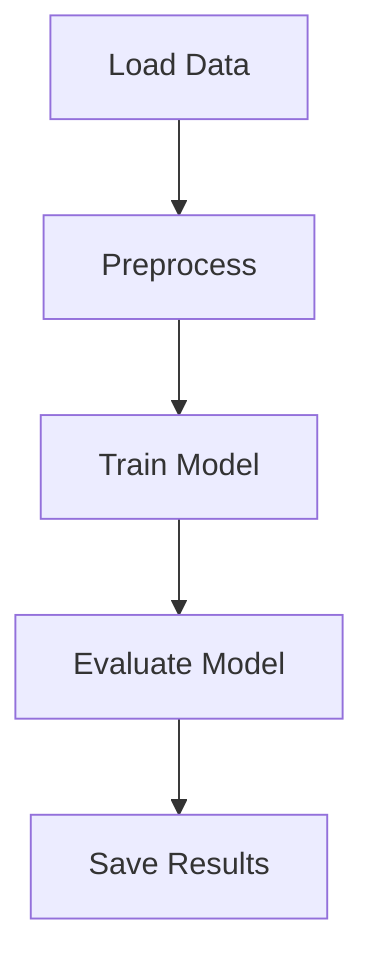

# ML Pipeline: Breast Cancer Classification

Доступно по адресу: [http://91.200.12.9:8080](http://91.200.12.9:8080). Логин и пароль переданы в ответе на задание.


## Цель проекта

Построение устойчивого ML-пайплайна в Apache Airflow для автоматизации всего процесса: загрузка, предобработка, обучение, оценка и сохранение модели по задаче бинарной классификации рака груди (Breast Cancer Wisconsin Diagnostic).

Результатом бинарной классификации должно стать предсказание, является ли опухоль злокачественной или доброкачественной на основе набора диагностических признаков.



---

##  Результаты модели

| 📊 Метрика     | Значение   |
|-------------|------------|
| Accuracy    | 0.9580     |
| Precision   | 0.9615     |
| Recall      | 0.9259     |
| F1-score    | 0.9434     |


---

## Mermaid Схема пайплайна



---

## Описание шагов

1. **load\_data.py**: загружает датасет breast cancer из `sklearn.datasets` и сохраняет в XCom;
2. **preprocess.py**: разбивает данные на X/y, нормализует и сериализует обратно в XCom;
3. **train\_model.py**: обучает `RandomForestClassifier`, сериализует модель в `joblib`, сохраняет в `/opt/airflow/results/model.pkl`;
4. **evaluate.py**: вычисляет метрики (`accuracy`, `f1`, `precision`, `recall`), сохраняет в `metrics.json`;
5. **save\_results.py**: копирует артефакты в финальные файлы `final_model.pkl`, `final_metrics.json`.

---

## Инструкции по запуску

1. Установите Docker и docker-compose.
2. Клонируйте репозиторий:
   ```bash
   git clone https://github.com/lexgp/airflow.git
   cd airflow
   ```
3. Запустите сервис:
   ```bash
   docker compose up -d --build
   ```
4. Перейдите в веб-интерфейс Airflow ([http://localhost:8080](http://localhost:8080)) и запустите DAG `ml_pipeline` вручную.

---

## Хранение и структура данных

- Все результаты сохраняются локально в контейнере:
  - `/opt/airflow/results/model.pkl`
  - `/opt/airflow/results/final_metrics.json`
  - `/opt/airflow/results/final_model.pkl`

Они помещены в папку [result_dump](result_dump/) данного репозитория.

---

### Использовано:

- ENV-переменные в .env, образец можно взять в .env.example
- Логирование в каждом модуле

**Docker** позволяет запускать Airflow с минимальной настройкой.

---

## Интеграция с Airflow

- DAG `ml_pipeline` подгружается из `dags/pipeline_dag.py`
- Все скрипты расположены в `etl/`
- Используются `PythonOperator` с передачей данных через `XCom`

### Пример кода в DAG:

```python
load_task = PythonOperator(
    task_id="load_data",
    python_callable=step_1_load,
    retries=2,
    retry_delay=timedelta(minutes=1),
)
```

---

## Идеи для развития

- Загрузка пользовательских данных из API или облачного хранилища
- Интеграция алертов (Slack, Telegram) при сбоях DAG

---

## Потенциальные точки сбоя

- Недостаток оперативной памяти (RAM)
- Заканчивается дисковое пространство
- Повреждённые или невалидные данные — например, NaN, неверная форма массивов, неожиданные типы.
- Проблемы с XCom (перегрузка, большие объекты) — передача больших данных через XCom может быть неустойчивой.
- Перезапуск/обновление ВМ во время выполнения DAG — потеря контекста, файлов и состояния.
- Долгое выполнение шагов → таймауты Airflow — если шаги не укладываются в execution_timeout.

---

## Содержание проекта на сервере

```
.
├── dags/
│   └── pipeline_dag.py
├── etl/
│   ├── load_data.py
│   ├── preprocess.py
│   ├── train_model.py
│   ├── evaluate.py
│   └── save_results.py
├── results/
│   └── (появляются после запуска)
├── result_dump/
│   └── final_metrics.json
│   └── final_model.pkl
├── docker-compose.yml
├── requirements.txt
├── .env
└── README.md
```
